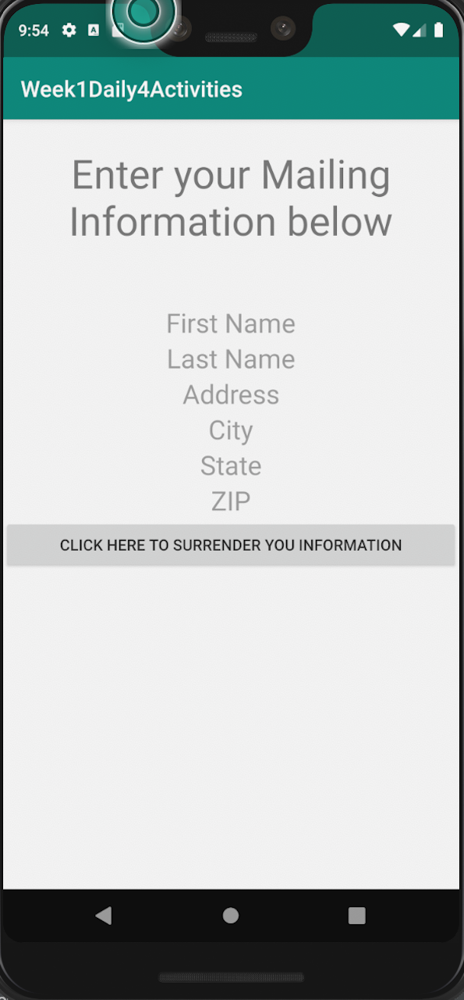
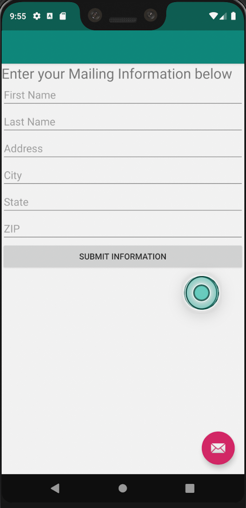
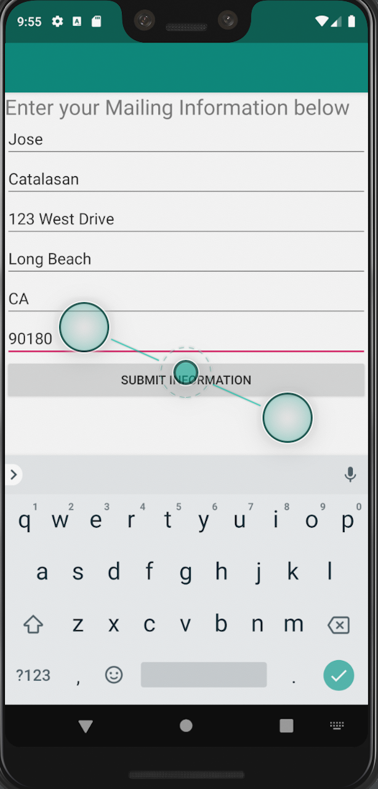
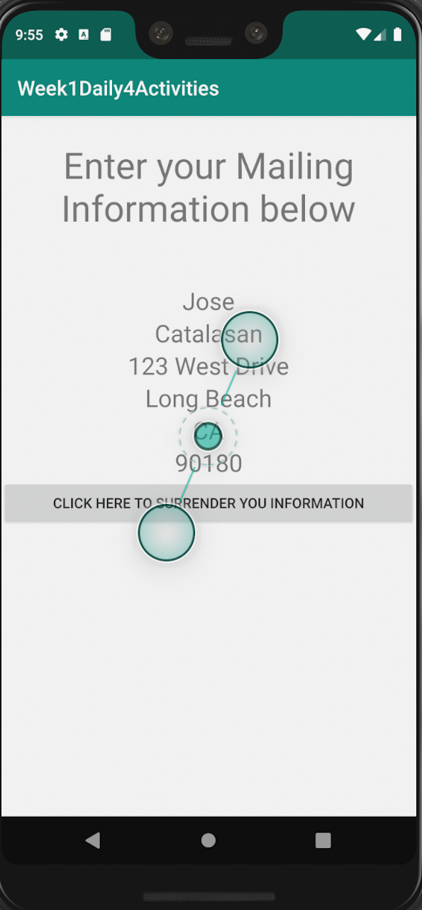

# Week1Daily4Activities

This Android application aims to have the user input mailing information and display that information.
The initial Activity shown displays TextViews with default values and a Button that starts the editting process by starting a second Activity.
The second Activity, shows EditText views where the the user inputs the mailing information and another Button to send this data back to the first Activity.
Once the first activity receives the result from the second activity, it displays that information in the TextViews.

The initial Activity uses startActivityForResult() to start the second activity and waits for a result to be passed.
The second Activity, uses a MailingInfo Object to store the information in the EditText views when the Button is pressed.
The MailingInfo Object implements the Parcelable interface in order to be stored within a Bundle.
The second activity stores the MailingInfo within a Bundle as a parcel, and then this Bundle is stored within an Intent.
The Intent is passed back to the initial Activity through the setResult() method.
After the initial Activity, receives the Intent from the second activity, it extracts the Bundle, then the MailingInfo Object and changes the texts of the TextViews using the information within the MailingInfo object.

The application also preserves the information present within the TextViews when the orientation of the application changes, to ensure that the data in the TextViews is not lost.

